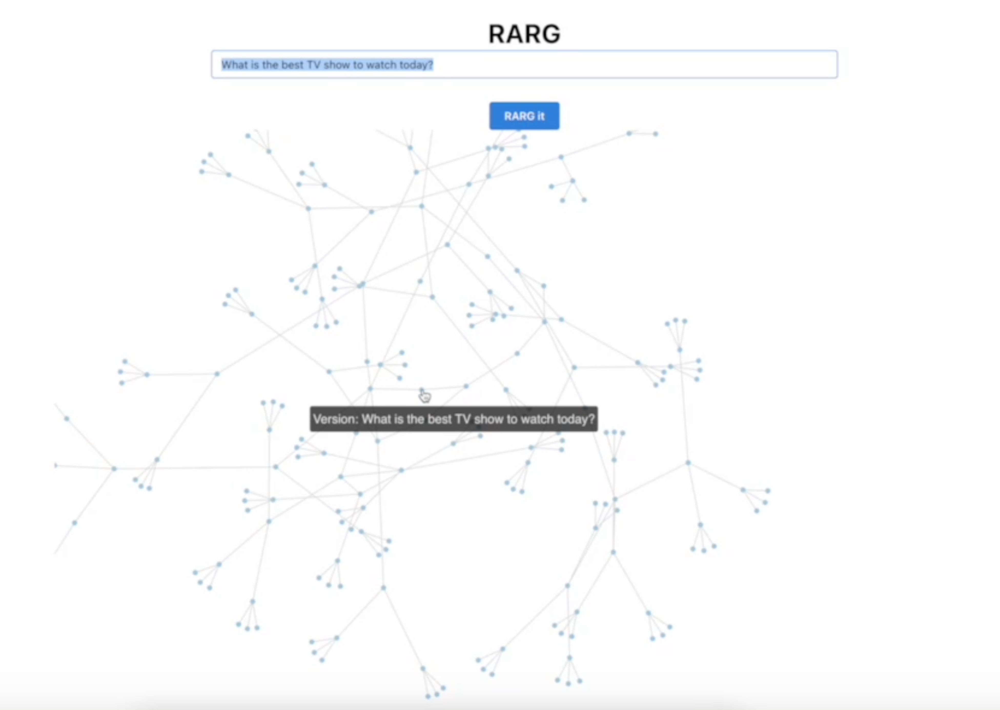
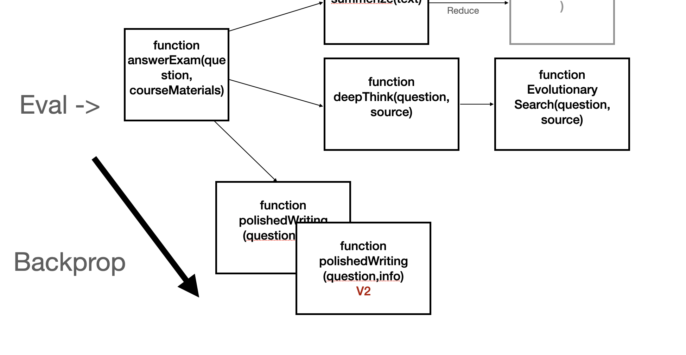

# Victor: Higher Intelligence with LLMs
By [Alex Pareto](https://alexpareto.com/) and [Sam Kaplan](https://samkaplan.me/)

Victor is a new architecture for higher-level intelligence with LLMs. Right now, LLMs are limited in their ability to learn. After the initial train, you’re pretty much limited fine-tuning them. This is a manual and brittle process.

Victor is based on a simple insight: evolutionary algorithms around code are very good at improving the reasoning ability of LLMs (EUREKA, Deepmind, etc). Given a task `T(inputData) → Answer`, Victor automatically decomposes this task into sub-functions. Victor creates a graph where each node is a function. Through this representation, we can define actions on the graph:

- **Generate** - Look at each function and write a new version. The new version could also include new sub-functions. Changing the function must be backwards compatible, so that dependent functions continue to function. New versions are added to the graph, but do not replace previous functions.
- **Backpropgate** - The generate steps create more functions. The backprop step evaluates and ranks the functions.  A critical insight for automated prompt revision is how to effectively create an objective function over arbitrary prompts. Our initial implementation solves this by viewing this as a ranking problem. Two versions of a function are chosen to be compared. In addition, the output node is chosen. The output node can be the function itself, or it could be an upstream function. In this way, a change in the version of a highly nested function, can be evaluated on its effect to the final output.
- **Evaluate** - This means solving the task `T(inputData)` . Nodes are chosen based on their quality from backpropagate, with `temperature` introducing randomness.   All inputs and outputs are automatically captured for each node/function call, so the granular data can be used in backpropogating.

With this, we have a system which can autonomously learn and improve. Generate intelligently improves the solution of the problem through rewriting functions, and decomposing the function into finer and finer steps. Backprop then granularly evaluates the new functions with existing sample data.

Most impressively, the more tasks given to Victor, the better it becomes on new tasks, since it has a bigger and bigger repertoire of functions to use.

## Example use cases

Victor is especially good for use cases involving transformations over data.

- Question answering
    - Given podcast transcripts, which are the best episodes?
    - Automatically compute statistics across lots of subcomponents of data (i.e. financial data)
- Detailed data analysis and essay writing
- Agentic behavior - self-learning

## Current implementation

- Working End2End
- Program graph schema
    - Function dependencies
    - Full invocation history
- Program generation
    - Automatically generate programs based on a task
    - Program improvements
    - Sub-function decomposition and generation
- Program execution
    - Automatically compose dependencies and execute
    - Automatically store input and outputs of *every* function call node. (Code is transpiled to inject state management between each function call)
    - Automatic rewriting if errors
- Evaluation, fitness, and backpropogation
- Frontend

## Further extensions

The current implementation is very basic. A significant enhancement would be to conceptualize each node’s quality not as a fixed value, but as a probability distribution. Each node $i$ would be assigned a normal prior distribution for its fitness parameter $beta_i$, denoted as $beta_i \sim N(\mu_0, \sigma_0^2)$. This prior would then be updated based on observed outcomes from pairwise comparisons using a Bradley-Terry model likelihood, yielding a new posterior distribution. The likelihood that node \(i\) is preferred over node \(j\) is given by:

$$
P(i \text{ preferred over } j) = \frac{\exp(\beta_i)}{\exp(\beta_i) + \exp(\beta_j)}
$$

The posterior distribution $p(\beta | \text{data})$ is updated according to Bayes' theorem:

$$
p(\beta_i | \text{data}) \propto \text{Likelihood}(\text{data} | \beta_i) \times p(\beta_i)
$$

With this formulation, the system can strategically choose the next node to measure in a manner that maximizes information gain. This decision is based on the expected reduction in uncertainty about the node’s fitness, quantified by the variance of the posterior distribution. The node selected for the next measurement, say node $k$, is the one that maximizes the expected information gain $Delta I(k)$, calculated as follows:

$$
\Delta I(k) = H(\beta_k) - E[H(\beta_k | \text{new data from } k)]
$$

where $H(\beta_k)$ is the entropy of the current posterior distribution of node $k$, and $E[H(\beta_k | \text{new data from } k)]$ is the expected entropy of the posterior distribution after observing new comparison data involving node $k$.

More evaluation modules could be written, such as an agentic evaluator that can autonomously make a deeper decision of the better output. 

More complex backprop algorithms could be used, such as ones that allow for updating more than two nodes at once.